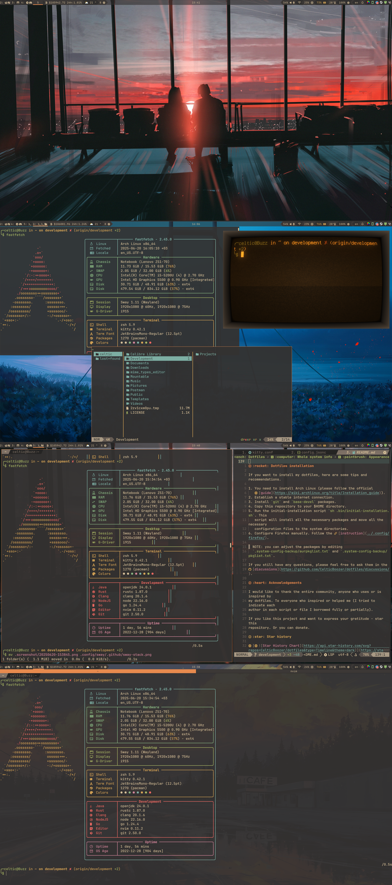

# Sway

[Sway](https://github.com/swaywm/sway/) Window Manager is a tiling window manager
and a drop-in replacement for i3, built specifically for the Wayland display
server. I chose it because of: lightweight, tiling, customization, minimalism.

## Configuration tree

Instead of configuring the entire window manger in a single file, I chose the
modular configuration path.

Where to change things:

- **config** - top-level variables and the `config.d` includes.
- **config.d/colors.conf** - the generated Gruvbox palette. Use
  `.bin/set-contrast.sh` to change contrast instead of editing generated
  palette files by hand.
- **config.d/theme.conf** - borders, gaps, titlebars, client colors, and other
  visual window settings.
- **config.d/keybinds.conf** - keyboard shortcuts and application launchers.
- **config.d/daemons.conf** - startup services, background utilities, and the
  wallpaper startup command.
- **config.d/input.conf** - keyboard and touchpad settings.
- **config.d/floating.conf** - floating-window and special application rules.

## Hotkeys

| Function                                          | Hotkey              |
|---------------------------------------------------|---------------------|
| mod                                               | Win                 |
| Execute term                                      | mod+Return          |
| Kill container                                    | mod+Shift+q         |
| Execute rofi                                      | mod+d               |
| Reload sway                                       | mod+Shift+r         |
| Focus on left container                           | mod+[Left/h]        |
| Focus on down container                           | mod+[Down/j]        |
| Focus on up container                             | mod+[Up/k]          |
| Focus on right container                          | mod+[Right/l]       |
| Move container left                               | mod+Shift+[Left/h]  |
| Move container down                               | mod+Shift+[Down/j]  |
| Move container up                                 | mod+Shift+[Up/k]    |
| Move container right                              | mod+Shift+[Right/l] |
| Focus on workspace [0-9]                          | mod+[0-9]           |
| Move container to workspace [0-9]                 | mod+Shift+[0-9]     |
| Split container horizontally                      | mod+b               |
| Split container vertically                        | mod+v               |
| Layout container stacking                         | mod+s               |
| Layout container tabbed                           | mod+w               |
| Layout container in current split mode            | mod+e               |
| Full-screen container                             | mod+f               |
| Make container floating                           | mod+Shift+space     |
| Reload sway config                                | mod+Shift+c         |
| Focus between floating and not                    | mod+space           |
| Focus on parent container                         | mod+a               |
| Focus on child container                          | mod+Shift+a         |
| Enter the resize mode                             | mod+r               |
| Execute Firefox developer edition                 | mod+Shift+t         |
| Execute Firefox developer edition(private window) | mod+Shift+p         |
| Screenshot select area                            | Print               |
| Screenshot current container                      | mod+Print           |
| Screenshot current workspace                      | mod+Shift+Print     |
| Execute Dolphin file manager                      | mod+t               |
| Execute cool-retro-term                           | mod+Shift+Return    |
| Execute swaylock                                  | mod+Escape          |
| Execute SwayNC notification panel                 | mod+n               |
| Exit sway                                         | mod+Shift+e         |
